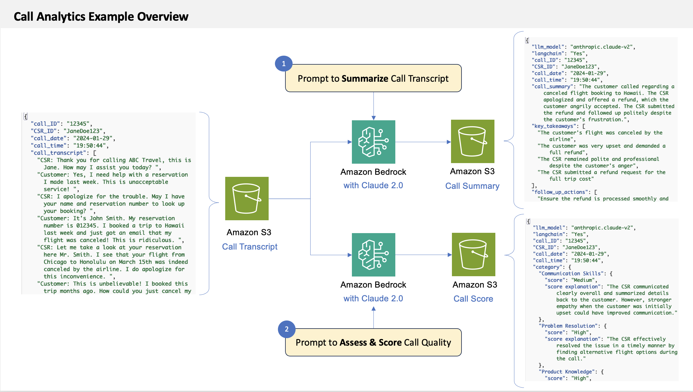

# Call Analytics Example with Amazon Bedrock and Anthropic Claude

### Introduction

Amazon Bedrock is a fully managed service that provides access to FMs from third-party providers and Amazon available via an API. With Bedrock, you can choose from a variety of models to find the one that’s best suited for your use case. 

This repository provides a notebook example with sample call transcripts to demonstrate how customers can leverage Anthropic's Claude large language model via Amazon Bedrock for call analytics tasks like summarization and quality assessment. 

The solution also utilizes [LangChain framework with Pydantic parser](https://python.langchain.com/docs/modules/model_io/output_parsers/types/pydantic). This output parser allows users to specify an arbitrary JSON schema as a Pydantic Model and query LLMs for outputs that conform to that schema.

### Use case

XYZ is a travel booking and vacation experience company. Customers can contact XYZ customer service representatives (CSRs) by phone to book new trips or modify existing reservations. These customer-CSR conversations are recorded, transcribed after the call ends, and analyzed by the call center management team to improve customer service processes and policies. The call transcription and analysis approach is also applicable for assessing customer interactions via email, chat, and other mediums.

### How does this work?

Transcript Ingestion
- Customer service call transcripts are uploaded as JSON objects to an S3 bucket. Plain text formats are also supported.  

Summarization Workflow
- The transcript is retrieved from the S3 source bucket and fed as a prompt to Claude, an AI assistant from Anthropic.  
- Leveraging natural language capabilities, Claude analyzes the dialogue and returns a JSON summary highlighting key discussion points and outcomes. This step uses LangChain for natural language processing and Pydantic for output structuring.

Quality Analysis Workflow  
- The full transcript is also analyzed by Claude against pre-defined quality criteria such as issue resolution, adherence to process standards, etc.  
- Assessment results are returned by Claude in a JSON format conforming to Pydantic schemas. Powered by LangChain for natural language comprehension and Pydantic for output formatting.

The two independent workflows allow simultaneous call summarization and quality analysis based on a single transcript ingestion event.

### Contents

This repository contains:

- [Notebook with Call Summarization and Call Quality Assessment code](./call_analytics_claude_langchain_pydantic.ipynb)

- Sample call transripts in `./data/` folder of this repository

## Getting started

### Choose a notebook environment

The **Python notebooks** provided in this lab can be run from the environment of your choice:

- For a fully-managed environment with rich AI/ML features, we'd recommend using [SageMaker Studio](https://aws.amazon.com/sagemaker/studio/). To get started quickly, you can refer to the [instructions for domain quick setup](https://docs.aws.amazon.com/sagemaker/latest/dg/onboard-quick-start.html).
- If you prefer to use your existing (local or other) notebook environment, make sure it has [credentials for calling AWS](https://docs.aws.amazon.com/cli/latest/userguide/cli-chap-configure.html).

### Enable AWS IAM permissions for Bedrock

The AWS identity you assume from your notebook environment (which is the [*Studio/notebook Execution Role*](https://docs.aws.amazon.com/sagemaker/latest/dg/sagemaker-roles.html) from SageMaker, or could be a role or IAM User for self-managed notebooks), must have sufficient [AWS IAM permissions](https://docs.aws.amazon.com/IAM/latest/UserGuide/access_policies.html) to call the Amazon Bedrock service.

Refer to [Amazon Bedrock documentation](https://docs.aws.amazon.com/bedrock/latest/userguide/what-is-bedrock.html) to set up and configure permissions. For more information on the fine-grained action and resource permissions in Bedrock, check out the [Bedrock Developer Guide](https://docs.aws.amazon.com/bedrock/).

